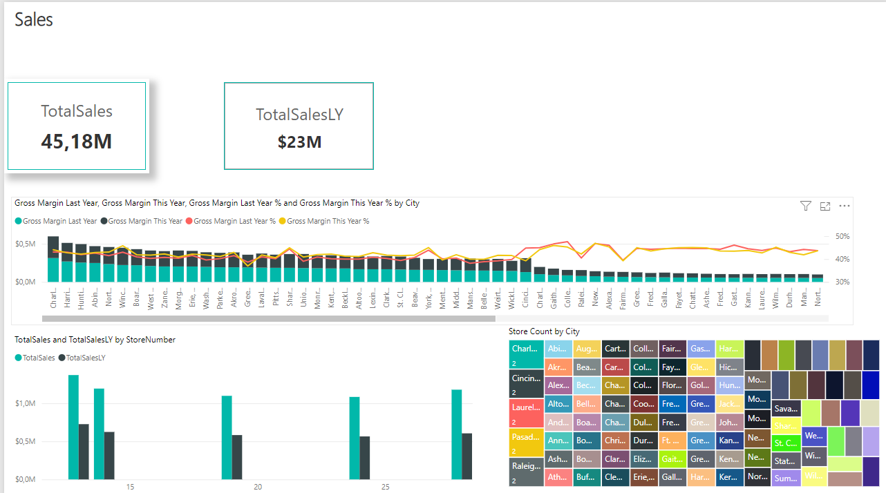
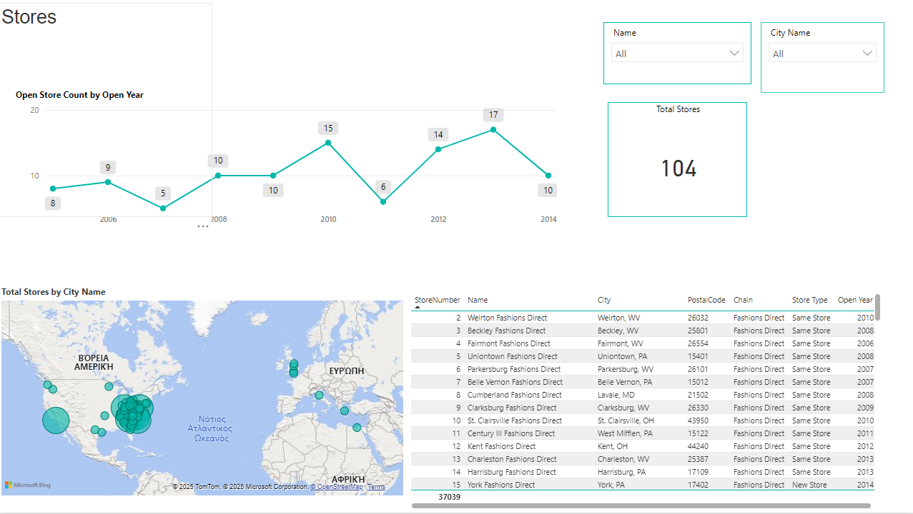

# 📊 Power BI Dashboards

Αυτό το αποθετήριο περιλαμβάνει δύο διαδραστικά dashboards που δημιουργήθηκαν στο Power BI, βασισμένα σε δεδομένα πωλήσεων και καταστημάτων.

---

## 🧾 Sales Dashboard

- Συνολικές Πωλήσεις (45,18M)
- Σύγκριση με προηγούμενο έτος
- Gross Margin per City
- Οπτικοποίηση με γραφήματα και metrics

---

## 🏬 Stores Dashboard

- Εξέλιξη καταστημάτων ανά έτος ίδρυσης
- Τοποθεσία καταστημάτων σε χάρτη
- Πίνακας καταστημάτων με φίλτρα

---

